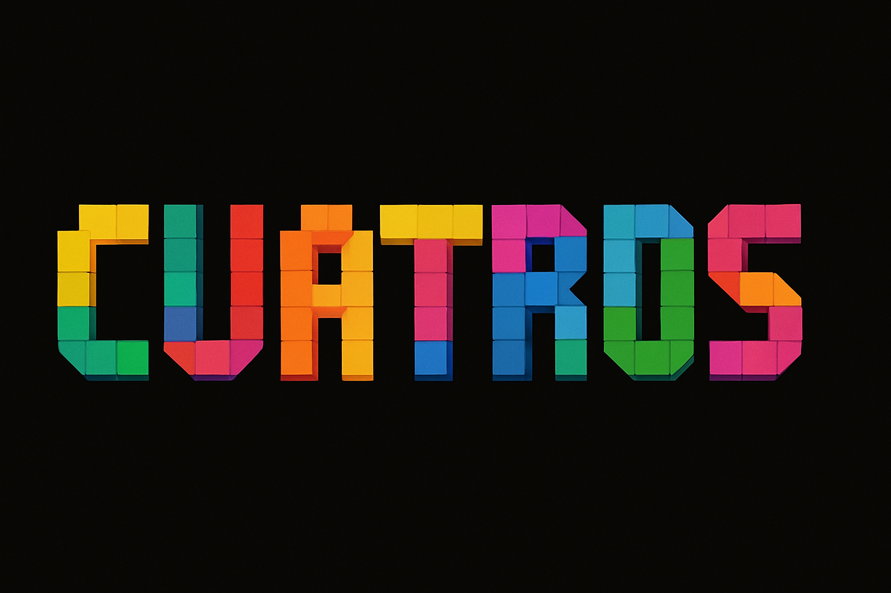

# CUATROS

          

## Instructions

Cuatros is a block puzzle game where players shift and rotate falling four-square shaped blocks to fill lines horizontally. As the lines of blocks are filled, the lines will be cleared, awarding the player points for each line cleared. As the game progresses, the blocks will fall at a higher rate and will require quicker decision making to survive. The game ends when the player's screen is filled to the top with no more space for another block to spawn. The score is calculated by how many blocks have been placed and the number of lines that have been cleared.

## Controls

The controls of this game are quite simple. You can navigate the current block by either using the arrow keys or WASD.
- LEFT ARROW / A - shift block left
- RIGHT ARROW / D - shift block right
- DOWN ARROW / W - move block down
- UP ARROW / S - rotate block

## Story Points: Second Sprint Completion (13 Points)
- Title Screen: 1 point  
- About Screen: 1 point  
- Help Screen: 1 point  
- Game Music: 2 points  
- Game Window: 1 point  

* Gameplay - Spawn Blocks: 1 point
* Gameplay - Controls: 2 points
* Gameplay - Rotate Block: 1 point
* Gameplay - Collisions: 2 points
* Gameplay - Pause Menu: 1 point

## Final Sprint Targets (13 Points)
- Scoring: 1 point
- Difficulty Levels (Speed): 1 point
- Leaderboard: 2 points
- Sound Effects: 2 points

* Gameplay - Randomize Block: 2 points
* Gameplay - Show Next Blocks: 1 point
* Gameplay - Line Clearing: 2 points
* Gameplay - Hold Block: 2 points
  
### Additional features (11 Points)
* Optional Cheat Mode: 3 points
* Optional Game Levels: 3 points
* Optional Power-ups: 2 points
* Optional Save/Load: 3 points

## Game Preview (SECOND SPRINT)
Click [this link](https://www.loom.com/share/7bd0ea2c24794fff97b0d08d0bfc6aed?sid=852407d6-2380-4e66-8276-b75fb81ea026) to see the a preview of the CUATROS run with the progress made so far.

Click [this link]([https://www.loom.com/share/7bd0ea2c24794fff97b0d08d0bfc6aed?sid=852407d6-2380-4e66-8276-b75fb81ea026](https://5dn3jjn9-5500.use2.devtunnels.ms)) to see the program structure in live global host.

### CUATROS Title Screen

### CUATROS Game Screen

## Expenses and Contributions

|      Name          | Total Hours | Journal |
|--------------------|-------------|---------------              
|    John Tam        |      11     | [John](https://github.com/bjucps209/group-project-team-jd/wiki/Project-Journal#john-tam)|
|   David Geddam     |      19     | [David](https://github.com/bjucps209/group-project-team-jd/wiki/Project-Journal#david-geddam)|
|  Daniel Cornelius  |      5.5    | [Daniel](https://github.com/bjucps209/group-project-team-jd/wiki/Project-Journal#daniel-cornelius)|

## Credits

> + John Tam [github.com](https://github.com/jtam496)
> + David Geddam [github.com](https://github.com/dave21-py)
> + Daniel Cornelius [github.com](https://github.com/dcorn713)

## Contact

For any questions or concerns, please feel free to contact us
+ David Geddam [linkedin.com](https://www.linkedin.com/in/david-geddam/)
