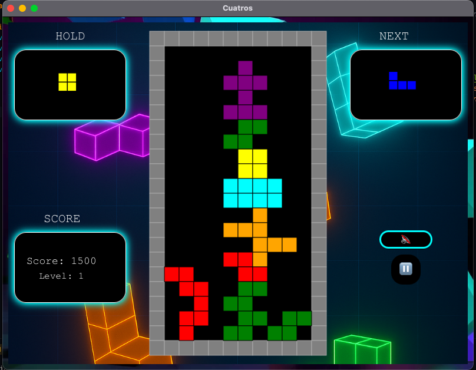

<p align="center">
  <!-- Replace with your own logo path if you like -->
  
  <p align="center">A fast‑paced, four‑square block puzzle built with JavaFX.</p>
</p>

<p align="center">
  <!-- Shields.io badges -->
  
  
  
  
  
  
</p>

<p align="center">
  <a href="CuatrosGame.mp4">View Demo</a> ·
  <a href="https://github.com/bjucps209/group-project-team-jd/issues/new?labels=bug&template=bug_report.md">Report Bug</a> ·
  <a href="https://github.com/bjucps209/group-project-team-jd/issues/new?labels=enhancement&template=feature_request.md">Request Feature</a>
</p>

---

## ❔ Overview

Cuatros is a block puzzle game where players shift and rotate falling four‑square‑shaped blocks to fill lines horizontally. As the lines of blocks are filled, the lines will be cleared, awarding the player points for each line cleared. As the game progresses, the blocks will fall at a higher rate and will require quicker decision making to survive. The game ends when the player's screen is filled to the top with no more space for another block to spawn. The score is calculated by how many blocks have been placed and the number of lines that have been cleared.

---

## 🎮 Controls

- **LEFT ARROW / A** – shift block left  
- **RIGHT ARROW / D** – shift block right  
- **DOWN ARROW / W** – move block down  
- **UP ARROW / S** – rotate block  
- **SPACEBAR** – drop block instantly  
- **C** – hold / change block  

---

## ✨ Story Points: Second Sprint Completion (13 Points)

- Title Screen: 1 point  
- About Screen: 1 point  
- Help Screen: 1 point  
- Game Music: 2 points  
- Game Window: 1 point  

* Gameplay – Spawn Blocks: 1 point  
* Gameplay – Controls: 2 points  
* Gameplay – Rotate Block: 1 point  
* Gameplay – Collisions: 2 points  
* Gameplay – Pause Menu: 1 point  

---

## 🎯 Final Sprint Targets (13 Points)

- Scoring: 1 point **COMPLETE**  
- Difficulty Levels (Speed): 1 point **COMPLETE**  
- Leaderboard: 2 points **COMPLETE**  
- Sound Effects: 2 points **COMPLETE**  

* Gameplay – Randomize Block: 2 points **COMPLETE**  
* Gameplay – Show Next Blocks: 1 point **COMPLETE**  
* Gameplay – Line Clearing: 2 points **COMPLETE**  
* Gameplay – Hold Block: 2 points **COMPLETE**  

---

## 👀 Game Demo (Final Sprint)

🎬 [Watch the demo](CuatrosGame.mp4)

### ✨ CUATROS Title Screen
<p align="center">
  
</p>

### ✨ CUATROS Game Screen
<p align="center">
  
</p>

---

#### System Requirements
> macOS & Windows supported (best performance on macOS)

---

## 🛠️ Quick Start

```bash
# 1) Clone the repo
git clone https://github.com/bjucps209/group-project-team-jd.git
cd group-project-team-jd

# 2) Build & run (macOS/Linux)
./gradlew clean run

#    Windows PowerShell
.\gradlew.bat clean run
```

#### Gradle Setup

```bash
gradle init --type java-application --dsl groovy --package app --test-framework junit-jupiter --use-defaults --overwrite 
```
#### Gradle commands

```bash
gradle clean build
```

```bash
gradle run
```

#### JavaFX Setup
##### Add a line to app/build.gradle
```bash
plugins {
    id 'application'
    id 'jacoco'
    id 'org.openjfx.javafxplugin' version '0.1.0'
}
```
#### Add a new block to the bottom of app/build.gradle:
```bash
javafx {
    version = "23.0.1"
    modules = [ 'javafx.controls', 'javafx.fxml', 'javafx.media' ]
}
```


## 🎯 Expenses and Contributions


|      Name          | Total Hours | Journal |
|--------------------|-------------|---------------              
|    John Tam        |      35     | [John](https://github.com/bjucps209/group-project-team-jd/wiki/Project-Journal#john-tam)|
|   David Geddam     |      40     | [David](https://github.com/bjucps209/group-project-team-jd/wiki/Project-Journal#david-geddam)|
|  Daniel Cornelius  |     30.5    | [Daniel](https://github.com/bjucps209/group-project-team-jd/wiki/Project-Journal#daniel-cornelius)|

## ✨ Credits

> + John Tam [github.com](https://github.com/jtam496)
> + David Geddam [github.com](https://github.com/dave21-py)
> + Daniel Cornelius [github.com](https://github.com/dcorn713)

## 🚀 Citation

If you find our work useful, please consider citing:

```
title={CUATROS},
  author={John Tam, Daniel Cornelius and David Geddam},
  journal={[Journal](https://github.com/bjucps209/group-project-team-jd/wiki/Project-Journal#david-geddam)},
  year={2025}
}
```
